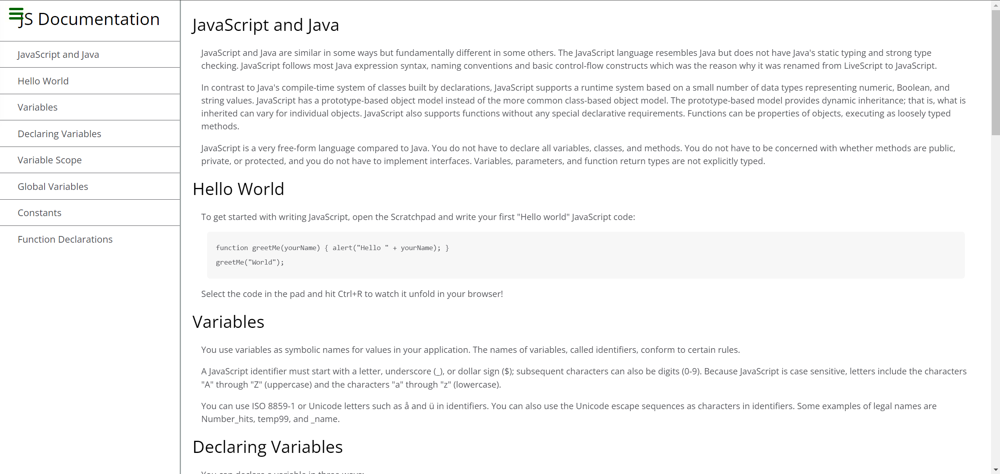

# [FCC Technical Documentation Page](https://www.freecodecamp.org/learn/responsive-web-design/responsive-web-design-projects/build-a-technical-documentation-page)

This is a solution to the [Technical Documentation Page](https://www.freecodecamp.org/learn/responsive-web-design/responsive-web-design-projects/build-a-technical-documentation-page). Freecodecamp Responsive Web Design course help you to make a responsive website use html and css.

## Table of contents

- [Overview](#overview)
  - [Screenshot](#screenshot)
  - [Links](#links)
- [My process](#my-process)
  - [Built with](#built-with)
  - [What I learned](#what-i-learned)
  - [Continued development](#continued-development)
  - [Useful resources](#useful-resources)
- [Author](#author)
- [Acknowledgments](#acknowledgments)

## Overview

### Screenshot

### Links

- Solution URL: [https://github.com/jhonmicc/fcc-technical-documentation](https://github.com/jhonmicc/fcc-technical-documentation)
- Live Site URL: [https://fcc-technical-docs-jhonmicc.netlify.app/](https://fcc-technical-docs-jhonmicc.netlify.app/)

## My process

### Built with

- Semantic HTML5 markup
- CSS custom properties
- Flexbox

### What I learned

I learned using of flexbox and media query

### Continued development

I don't do development continuously

### Useful resources

- (https://stackoverflow.com/) - This helped me for some error solution. I really liked this source and will use it going forward.
- (https://www.w3schools.com/) - This is an documentation which helped me understand all properties of css.

## Author

- Instagram - [@jhonmicc](https://www.instagram.com/jhonmicc/)
- Twitter - [@stilllearncode](https://twitter.com/stilllearncode)

## Acknowledgments

Special hat tip to God and my online friends, thank you.
